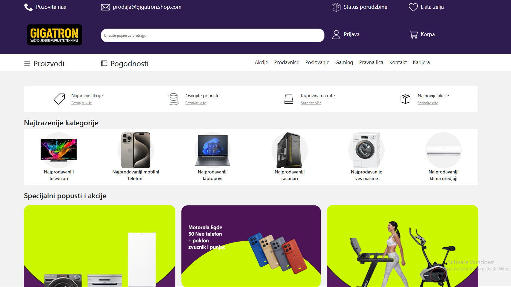
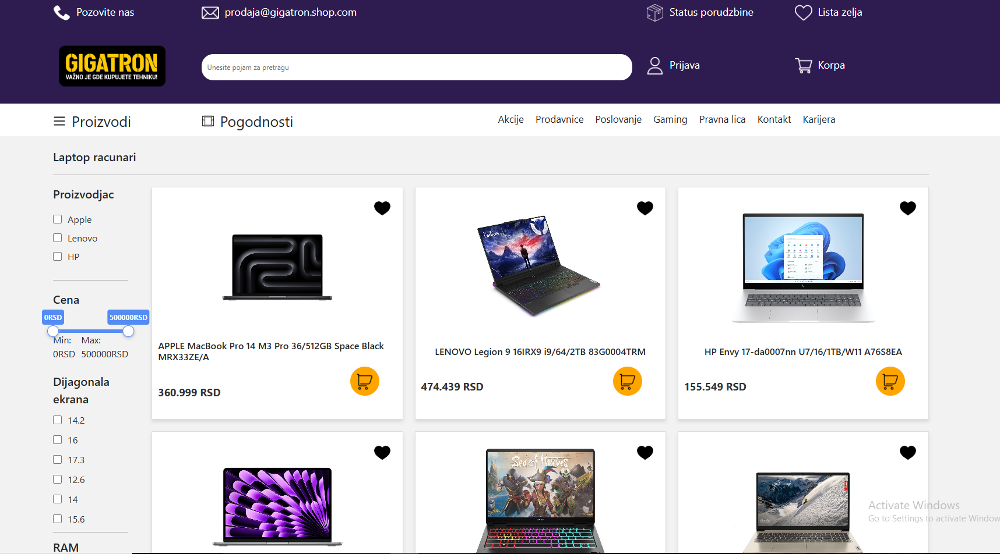
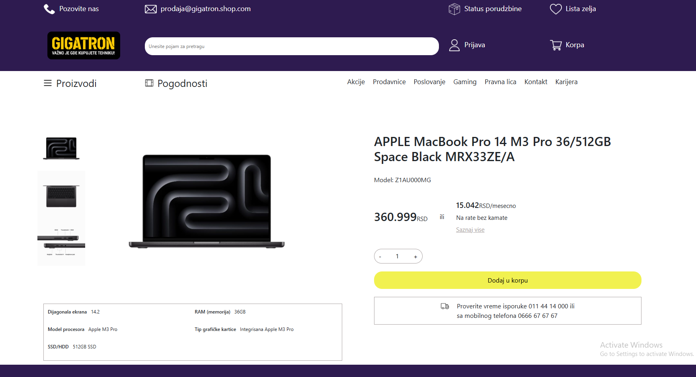
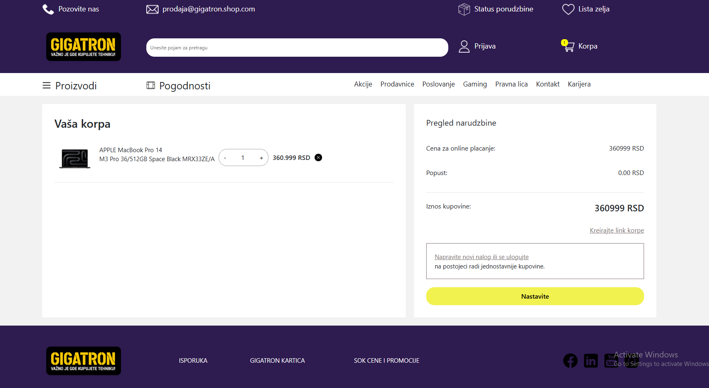
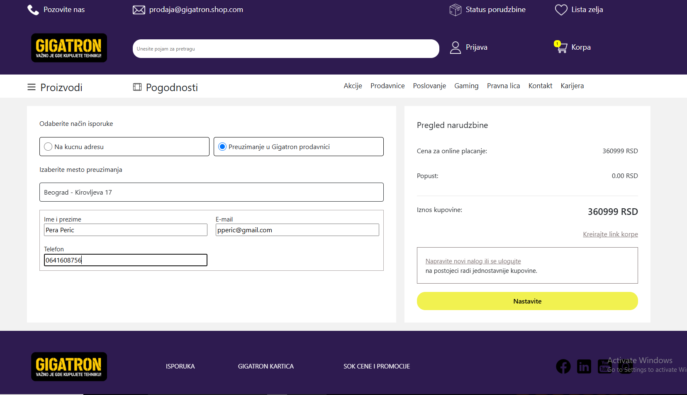
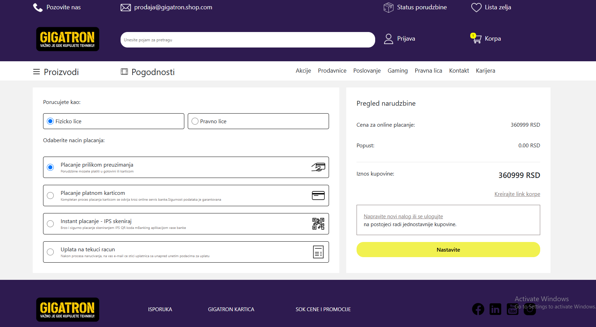
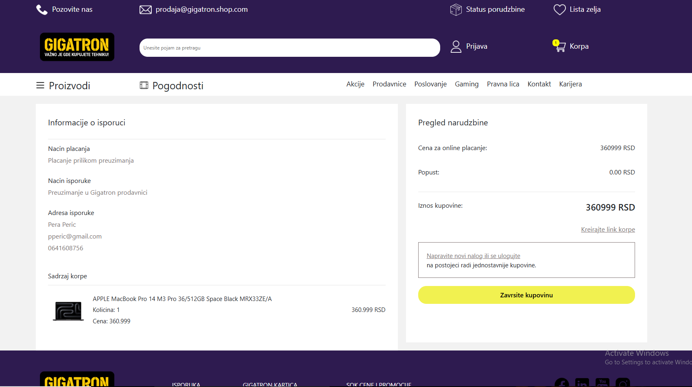

# Gigatron Web Shop Clone

Gigatron Web Shop Clone is a replica of the popular e-commerce site [Gigatron.rs](https://gigatron.rs). This project was created to practice and demonstrate frontend and backend development skills by building an interactive and functional web application.

---

##  Key Features
1. **Product Display:**
   - A list of products with information such as name, price, image, discount, and specifications.
   - Detailed product view with descriptions, technical specifications, and multiple images.

2. **Search and Filtering:**
   - Search for products by keywords.
   - Filter products by categories, brands, price range, and other attributes.

3. **Cart and Ordering:**
   - Add products to the cart.
   - View cart with a total price summary.
   - Ordering process with user data entry.

5. **Admin Panel:**
   - Features for adding, editing, and deleting products.
   - View and manage customer orders.

---

## Technologies
This project utilizes the following technologies:

### Frontend:
- **React.js**: For building interactive user interfaces.
- **CSS Modules**: For styling components with minimal style conflicts.
- **React Router**: For navigation and routing.

### Backend:
- **Node.js**: For server-side logic.
- **Express.js**: For creating API endpoints.
- **MongoDB**: As the database for storing products, users, and orders.
- **Mongoose**: For data modeling.

##  Screenshots

### Home Page

### Product Details

### Single product Details

### Cart

### Cart

### Cart

### Cart

